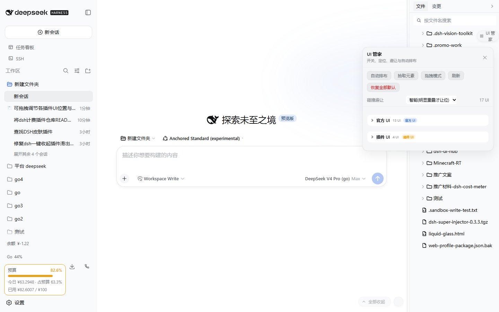
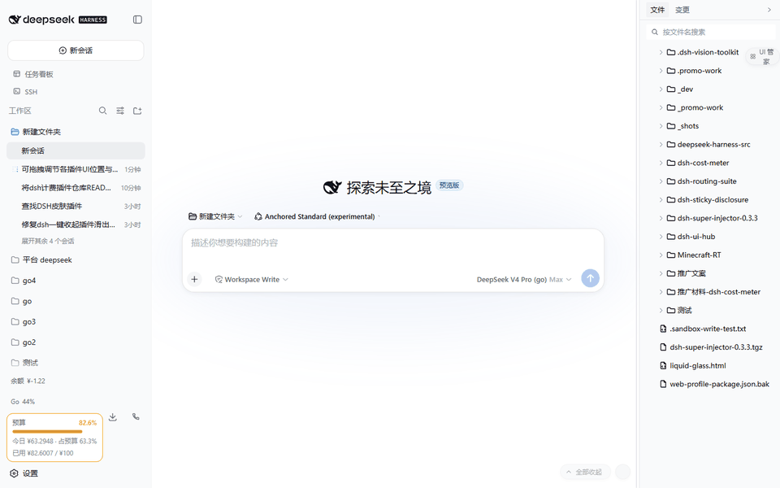
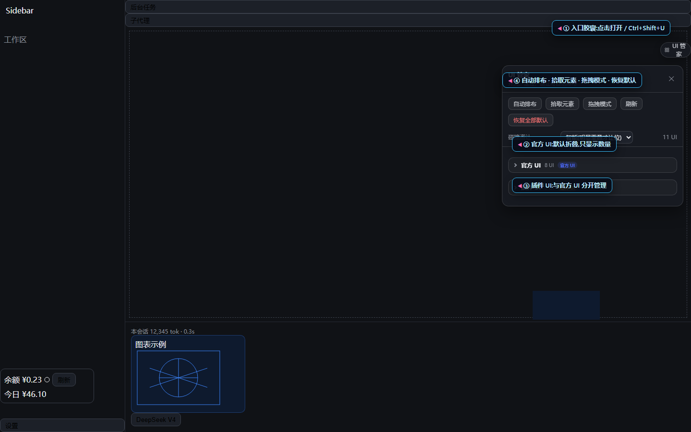
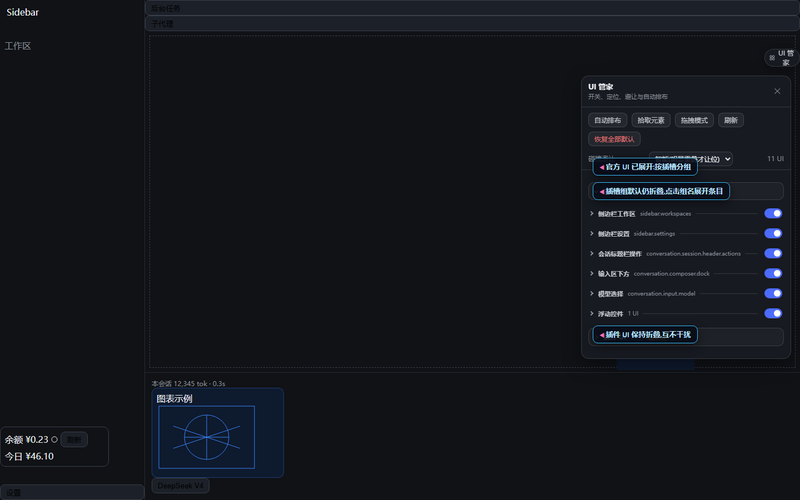
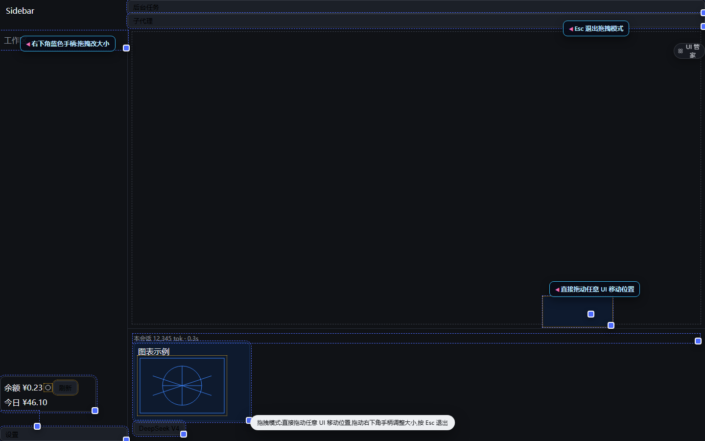

# dsh-ui-hub

[](LICENSE)
[](https://github.com/Han-1413141/dsh-ui-hub/actions/workflows/test.yml)
English | [中文](README.md)

A DSH web client plugin: **UI Hub**. It enumerates every UI contribution from every plugin — panels, buttons, icons, charts, fields — and lets you **toggle each one, position each one, avoid floating collisions, and auto-arrange them into a tidy column**.





## ✨ Features

| Feature | Description |
|---|---|
| 🔍 Full discovery | Enumerates every UI inside the platform's `[data-slot]` anchors plus floating widgets outside slots (dsh-sticky-disclosure pills, dsh-mingli-chart views, ...); unknown widgets can be captured with Pick element |
| 🗂️ Official vs plugin | The panel is split into **Official UI** and **Plugin UI** categories (every row also carries an official/plugin tag) |
| 📁 Collapsible groups | Two-level collapse (category → slot group), **all collapsed by default** so only category/group names + counts show; expand step by step, state is remembered |
| 🎚️ Per-widget control | Each UI root has its own switch; expand a root to toggle its inner **buttons / icons / charts / fields** individually |
| 📐 Three position modes | **Default** (restore), **Nudge** (translate without leaving the layout), **Float** (fixed positioning with exact x/y) |
| 🖱️ Direct drag mode | Enable Drag mode and **drag any UI directly to move it** (slot-mounted UIs use nudge and keep their layout; loose widgets float) or **drag its bottom-right grip to resize**; Esc exits |
| 🛡️ Collision avoidance | Off (report only) / Smart (clear overlaps) / Strict (any overlap); locked items stay put and push others away |
| ✨ One-click arrange | Packs every floating UI into right-aligned vertical columns anchored to the conversation scrollport |
| 💾 Persistent | Toggles, positions, sizes, and collapse state live in `localStorage` and are restored across refreshes |
| 🧹 Non-invasive & reversible | No plugin code is modified; only additive `data-uihub-*` attributes plus the hub's own `!important` stylesheet. Disposal removes every trace |

## Why

DSH is a plugin ecosystem and every plugin adds a bit of chrome: header buttons, composer badges, sidebar cards, bottom-right pills, floating charts. Plugins do not know each other's geometry, so overlap is the default. UI Hub keeps one roster and one floor plan for all of them:

1. Discover every UI and group it by slot;
2. Toggle, move, and lock each item;
3. Separate floating widgets that overlap;
4. Arrange scattered widgets into one aligned column in a click.

## 📸 UI gallery

Full captioned walkthrough: **[docs/GALLERY.md](docs/GALLERY.md)**.

**30-second demo: default collapsed → official UI expanded → group expanded → drag mode**



| Screen | Caption |
|---|---|
|  | The panel opens with only the two collapsed categories: Official UI / Plugin UI |
|  | Official UI expanded: slot groups appear, each still collapsed |
|  | One group expanded: per-row switches, official tag, position mode, `⋯` inner elements |
|  | Drag mode: dashed outlines for direct dragging, bottom-right grips for resizing, Esc to exit |

## Usage

1. Restart `dsh web` after installing. A **UI Hub** pill appears in the top-right corner (hotkey `Ctrl+Shift+U`, macOS `⌘⇧U`); click it to open the panel.
2. The panel opens with the two collapsed categories **Official UI / Plugin UI** (all collapsed by default). Click a category to reveal its slot groups, then click a group to list its UIs.
3. Each row: left switch shows/hides the item, `⋯` expands its detail.
4. Detail pane:
   - **Position mode**: default / nudge / float;
   - **X/Y** in float mode, **DX/DY** in nudge mode;
   - **Drag to move**: a grab handle appears at the widget corner;
   - **Lock**: collision avoidance never moves this item;
   - **Inner elements**: toggle buttons, icons, charts, and fields separately.
5. Toolbar:
   - **Drag mode**: drag any UI directly to move it, drag its corner grip to resize, Esc to exit;
   - **Auto arrange**: packs all float-mode UIs into right-aligned columns;
   - **Pick element**: click any element on the page (even unmarked ones) to manage it;
   - **Reset all**: clear every toggle, position, and size.

### API

```js
window.dshUiHub.items()                 // [{ key, label, plugin, category, slot, on, mode, x, y, sw, sh, children: [...] }]
window.dshUiHub.setConfig(key, { on: false })
window.dshUiHub.setConfig(key, { mode: "float", x: 300, y: 200 })
window.dshUiHub.setConfig(key, { sw: 360, sh: 240 })     // set size
window.dshUiHub.setConfig("child:...", { on: false })
window.dshUiHub.arrange()               // one-click auto arrange
window.dshUiHub.collisionMode("strict") // off | smart | strict
window.dshUiHub.dragMode(true)          // enable/disable direct drag mode
window.dshUiHub.open() / close() / reset()
```

## Behavior notes

- **Stable identity**: slot UIs are keyed `slot:<slot>@<index>` and re-attach across React re-renders; floating widgets are keyed by their `data-*` marker; picked elements by a structural path hash.
- **No style fights**: positions are enforced through `data-uihub-float` + CSS variables + `!important` rules, so other plugins' inline `left/top` writes cannot override them. Removing the attribute restores the plugin's own styles.
- **Dispose restores everything**: all `data-uihub-*` attributes, CSS variables, stylesheet, and hub chrome are removed.
- **Direct drag**: drag mode intercepts pointers only while enabled. Dragging a **slot-mounted UI uses nudge** (it stays inside the layout, so anchored popups follow it), while loose floating widgets move with float coordinates; the bottom-right grip resizes (float: resizes the floating box; default/nudge: pins an in-place size override). Ending a drag never re-fires the button's click; a plain click still reaches the plugin normally. Reset item restores the original; Esc exits.
- **Floated popup follower**: when an explicitly floated UI opens a popup that still appears at the original spot, the hub shifts it with the independent CSS `translate` property (only popups anchored at the original spot; centered full-page dialogs are untouched).
- **Locked items win**: arrange and avoidance skip locked items and route others around them.
- Panel and handles use z-index 80/86: above plugin floats, below app dialogs (100+).

## Install

> Requires Node.js ≥ 20 and DeepSeek Harness with the `dsh plugin` command.

One-liner (PowerShell):

```powershell
irm https://raw.githubusercontent.com/Han-1413141/dsh-ui-hub/main/install.ps1 | iex
```

Or:

```bash
dsh plugin --profile web add github:Han-1413141/dsh-ui-hub
```

Local development (run from the parent directory of this repo):

```bash
dsh plugin --profile web add link:./dsh-ui-hub
```

Remove: `dsh plugin --profile web remove dsh-ui-hub`.

## Tests

```bash
python test/verify.py   # Playwright chromium over test/mock.html
```

Covers discovery, official/plugin classification, default-collapsed categories with stepwise expansion, root/child toggles, float positioning, arrange alignment, strict collision avoidance, panel, hotkey, pick mode, direct drag move + drag resize, persistence across reload, and teardown.

## Known limitations

- **Float coordinate system**: float mode uses `position:fixed`. If a UI's ancestor carries a CSS `transform`, fixed positions resolve against that ancestor; use Nudge for such items.
- **Platform DOM changes**: discovery relies on the public `[data-slot]` anchors and plugin `data-*` markers. If the platform renames them, items reappear under new keys (old configs stay local).
- **Child identity**: inner elements are numbered in DOM order, so configs can follow a reordered neighbor after a plugin restructures its subtree.
- **No forced reflow inside slots**: default/nudge modes respect the original slot layout; for a full-page rearrangement, switch items to Float and use Auto arrange.
