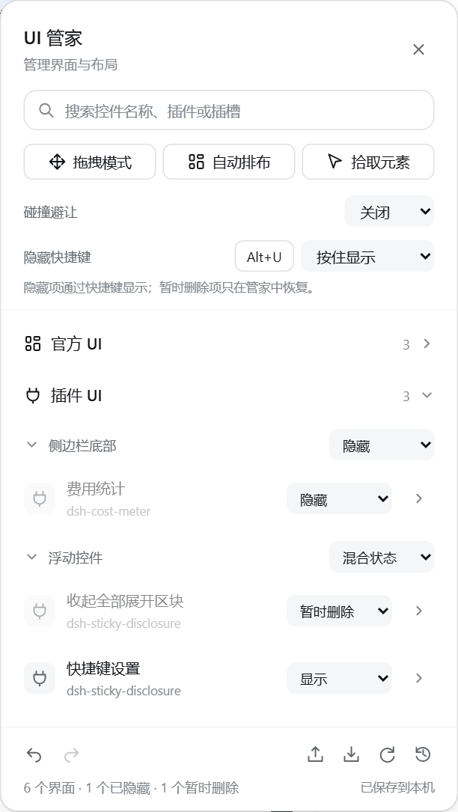
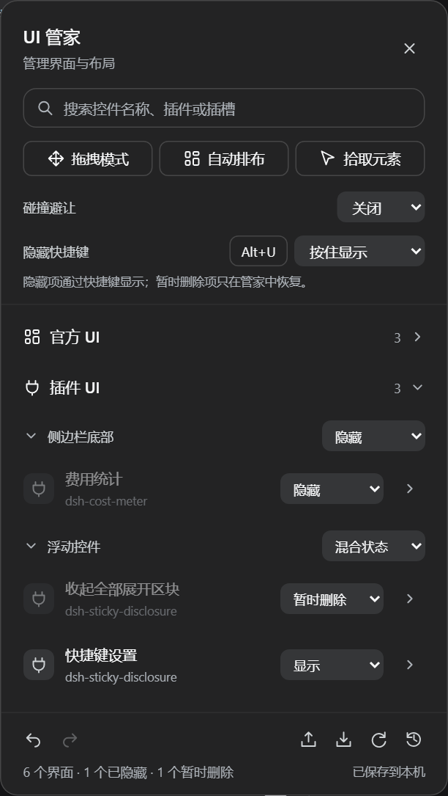

# dsh-ui-hub

[](LICENSE)
[](https://github.com/Han-1413141/dsh-ui-hub/actions/workflows/test.yml)
[English](README.en.md) | 中文

DSH 桌面端与 Web 插件：**UI 管家**。把页面上每个插件贡献的每个 UI（面板、按钮、图标、图表、输入框……）都枚举出来，支持**逐个开关、逐个定位、碰撞避让和一键美观排布**，专治插件一多之后的互相遮挡、挤成一团。

| 浅色主题 | 深色主题 |
|---|---|
|  |  |

上图为插件实际渲染结果，使用 DSH 0.2.0-rc.2 官方主题样式与本地示例控件。

## 界面与布局改进

- 使用 DSH 的背景、字体、圆角和紧凑控件；搜索置于顶部，拖拽、排布和拾取保持在同一行，备份与恢复操作收纳到面板底部。
- 控件和内部按钮的设置按身份关联；插入、重排或重新挂载已识别控件后，设置继续跟随原控件。已有布局自动迁移。
- 底部提供撤销、重做，当前页面保留最近 30 步修改；整组状态修改和恢复默认都可一次撤销。
- 搜索不丢失焦点，详情首次展开即可编辑；同组控件的状态不一致时显示「混合状态」。
- 保存失败时明确提示，可随时导出布局备份。浮动控件按新增节点更新索引，拖拽复用已有识别结果。

## 显示、隐藏与暂时删除

每个界面、内部元素和分组右侧都有显示状态菜单：

| 状态 | 行为 |
|---|---|
| 显示 | 按原有设置显示，不受隐藏快捷键影响 |
| 隐藏 | 平时不显示，通过隐藏快捷键临时显示或切换显隐 |
| 暂时删除 | 始终不显示，不受隐藏快捷键影响；在管家里选回「显示」即可恢复，位置和大小仍保留 |

默认隐藏快捷键为 **`Alt+U`（macOS 为 `⌥U`），按住显示、松开隐藏**。在面板的「隐藏快捷键」一行点击按键按钮可重新录制，右侧可改为「按一下切换」。`Esc` 取消录制；打开管家的 `Ctrl+Shift+U` / `⌘⇧U` 保持独立，不能用于隐藏快捷键。

输入文字、使用输入法或编辑下拉菜单时不会触发隐藏快捷键。按住显示时，松开任一所需按键或离开窗口会恢复隐藏；按住预览不会触发自动避让移动其他控件。暂时显示的状态不写入布局，刷新、导入布局或重新启用插件后重新隐藏。

「暂时删除」只控制显示，不卸载插件，也不删除配置。子元素仍受父界面约束：父界面暂时删除后，快捷键不会把内部按钮显示出来。原有 `on: false` 配置会保留为「暂时删除」，需要参与快捷键的控件请主动改为「隐藏」。三种状态及快捷键设置均支持撤销、重做和导出恢复。

## 查找与备份布局

- 在面板搜索框输入控件名称、插件名或插槽名，即可展开匹配项；清空搜索后恢复原有分组折叠状态。
- 点击「导出布局」保存 JSON 文件；点击「导入布局」恢复显示状态、位置、大小和分组设置。无效文件不会覆盖当前布局。
- 布局文件保存在本地，可在 Web 与桌面端之间手动转移。只有名称和结构相匹配的控件会沿用配置。
- 静止页面不再循环重写计数；插件重新启用后恢复正常工作。

## ✨ 功能

| 功能 | 说明 |
|---|---|
| 🔍 全量发现 | 枚举平台每个 `[data-slot]` 插槽里的插件 UI，以及脱离插槽的浮动控件（如 dsh-sticky-disclosure 的按钮、dsh-mingli-chart 的悬浮图）；不认识的新控件可用「拾取元素」点击捕获 |
| 🗂️ 官方 / 插件分区 | 面板顶层分成「官方 UI」与「插件 UI」两个类别，一眼分清平台自带的界面和第三方插件塞进来的界面 |
| 📁 分组折叠 | 类别与插槽组两级折叠，**默认全部折叠**，只显示类别和组名+数量，逐级展开才出现条目，界面干净易观察；展开状态自动记忆 |
| 🎚️ 精确到单个 UI | 每个 UI 根节点可分别显示、隐藏或暂时删除；再往下可展开到**内部元素**——按钮 / 图标 / 图表 / 输入框，单独设置 |
| 📐 三种位置模式 | **默认**（恢复原样）、**微调**（translate 平移，不脱离原布局）、**浮动**（fixed 定位，x/y 精确坐标） |
| 🖱️ 直接拖拽 | 面板点「拖拽模式」后：**直接拖动任意 UI 改变位置**（插槽内 UI 用平移保持布局与弹层跟随，漂浮控件用固定坐标），拖动元素**右下角手柄改变大小**；Esc 退出编辑 |
| 🛡️ 碰撞避让 | 三档：关闭（只报告）/ 智能（明显重叠才让位）/ 严格（任何重叠都让位）；锁定某项后只挤别人、不挤它 |
| ✨ 一键自动排布 | 以会话滚动区为锚点，把所有浮动 UI 沿右缘排成对齐的纵向列，自动换列、留白一致 |
| 💾 持久化 | 所有开关、位置、大小与折叠状态保存在浏览器 `localStorage`，刷新/重开会话后自动恢复 |
| 🧹 无侵入可还原 | 不修改任何插件代码；只给 DOM 加 `data-uihub-*` 标记 + 自己的 `!important` 样式。关闭/卸载插件即逐元素还原 |

## 为什么需要它

DSH 是插件生态，每个插件都会往页面塞一点 UI：会话标题栏按钮、输入区下方的徽章、侧边栏底部卡片、右下角浮动药丸、悬浮图表……插件之间互不知道对方在哪，**重叠是常态**。UI 管家给这些 UI 建立一份统一的「花名册 + 排班表」：

1. 自动发现所有 UI，按插槽分组列出来；
2. 每个 UI 都能关、能挪、能锁定；
3. 浮动控件互相重叠时自动让位；
4. 一键排布，把散落的控件整理成整齐的一列。

## 📸 界面与功能展示

完整图文说明见 **[docs/GALLERY.md](docs/GALLERY.md)**。

## 使用

1. 桌面端安装后选择「立即启用」，通过终端安装则重新打开应用；Web 版重启 `dsh web`。页面**右上角**出现「UI 管家」按钮（快捷键 `Ctrl+Shift+U` / macOS `⌘⇧U`），点击打开管理面板；
2. 面板顶层是**「官方 UI」/「插件 UI」两个折叠类别**（默认全部折叠，只显示类别与数量），点击类别展开其下按插槽分组的组名，再点击组名展开该组的 UI 条目；
3. 条目行：右侧选择「显示 / 隐藏 / 暂时删除」，箭头展开位置与内部元素设置；
4. 详情里：
   - **位置模式**：默认 / 微调 / 浮动；
   - 浮动模式填 **X/Y**，微调模式填 **水平/垂直偏移**；
   - **拖拽移动**：元素右上角出现抓手，直接拖；
   - **锁定位置**：碰撞避让时不移动它；
   - **内部元素**：按钮、图标、图表、输入框可分别设为显示、隐藏或暂时删除；
5. 常用操作与底部工具：
   - **拖拽模式**：开启后**直接拖任意 UI 移动位置，拖右下角手柄改变大小**，Esc 退出；
   - **自动排布**：把所有浮动 UI 沿会话区右缘排成对齐的列；
   - **拾取元素**：点击页面上任意元素（哪怕插件没做任何标记）纳入管理；
   - **恢复全部默认**：清空全部开关、位置与大小。

### 编程接口

```js
window.dshUiHub.undo()                 // undo one layout edit; returns boolean
window.dshUiHub.redo()                 // redo one layout edit; returns boolean
window.dshUiHub.exportLayout()         // export a portable layout object
window.dshUiHub.importLayout(data)      // restore an object or JSON string; returns boolean
window.dshUiHub.items()                 // [{ key, label, visibility, revealed, on, mode, x, y, children: [...] }]
window.dshUiHub.setConfig(key, { visibility: "hidden" }) // 用快捷键显示
window.dshUiHub.setConfig(key, { visibility: "removed" }) // 暂时删除，不受快捷键影响
window.dshUiHub.setConfig(key, { visibility: "shown" })   // 恢复显示，保留位置和大小
window.dshUiHub.setRevealShortcut({ code: "KeyU", alt: true, ctrl: false, meta: false, shift: false, mode: "hold" }) // mode: hold | toggle
window.dshUiHub.getRevealShortcut()                     // 当前快捷键设置的副本
window.dshUiHub.setConfig(key, { mode: "float", x: 300, y: 200 })
window.dshUiHub.setConfig(key, { sw: 360, sh: 240 })     // 设置宽高
window.dshUiHub.setConfig("child:...", { visibility: "hidden" }) // 内部按钮/图标同样支持三种状态
window.dshUiHub.setConfig(key, { on: false })            // 兼容旧接口，等同于暂时删除
window.dshUiHub.arrange()               // 一键自动排布
window.dshUiHub.collisionMode("strict") // off | smart | strict
window.dshUiHub.dragMode(true)          // 开启/关闭直接拖拽模式
window.dshUiHub.open() / close() / reset()
```

## 行为细节

- **控件身份**：优先使用明确标记、ID、已知插件类名及可访问名称建立映射，保留 `slot:…@N` 等现有键名。键名中的数字是已分配标识，不再跟随 DOM 顺序变化；内部元素同样单独关联。
- **不用 style 打架**：定位通过 `data-uihub-float` + CSS 变量 + `!important` 规则实现，其他插件写 inline `left/top`（非 important）无法覆盖管家设置的位置；去掉标记即恢复插件自己的样式。
- **卸载还原**：插件 dispose 时删除全部 `data-uihub-*` 标记、CSS 变量、样式表和自己的 UI 元素。
- **直接拖拽**：拖拽模式只在开启期间拦截指针；**插槽里的 UI 拖拽用「平移」**（保留在原布局内，点击弹出层会跟着走），脱离插槽的浮动控件拖拽用「浮动」坐标；拖右下角手柄改宽高（浮动模式改浮层大小，默认/微调模式原地固定宽高）。拖拽结束不会给原按钮补发一次 click，普通单击仍原样传给插件；「重置此项」可恢复原样，Esc 退出编辑。
- **浮动弹层跟随**：显式设成「浮动」的 UI 若点击后弹出层仍出现在原位置，插件会用独立的 CSS `translate` 把弹层平移到 UI 的新位置（只作用于锚定在原位置的弹层，居中的整页对话框不受影响）。
- **锁定的项目不动**：自动排布与碰撞避让都跳过锁定项，并把其他项绕开它。
- **避让不会无限循环**：观察器只对结构/托管元素样式变化触发重算，写 CSS 变量前先比较当前值，收敛后不再写。
- 面板/抓手 z-index 为 80/86，高于插件浮动层、低于应用弹窗层（100+），不会盖住权限与设置弹窗。

## 安装

**桌面端（DSH 0.2.0-rc.2）**：在侧栏打开「插件 → 添加插件」，粘贴下面的地址，安装后选择「立即启用」。若应用提示需要重启，按提示操作。

```text
github:Han-1413141/dsh-ui-hub
```

桌面端自带 Node 和 pnpm。使用终端安装时，先从应用菜单的「管理 dsh 命令」安装内置命令；启动过一次桌面端以初始化配置后，完全退出应用，再执行：

```bash
dsh plugin --profile desktop add github:Han-1413141/dsh-ui-hub
```

随后重新打开桌面端。**Web 版**使用独立的 `web` 配置：

```bash
dsh plugin --profile web add github:Han-1413141/dsh-ui-hub
dsh web
```

独立 CLI 遵循 DSH 的 Node 要求，本轮核验版本为 `^22.19.0 || >=24.0.0`；使用桌面端内置命令无需另装 Node 或 pnpm。

PowerShell 一键安装（检测到桌面端内置命令时选择 `desktop`，否则选择 `web`）：

```powershell
irm https://raw.githubusercontent.com/Han-1413141/dsh-ui-hub/main/install.ps1 | iex
```

需要指定目标时，下载 `install.ps1` 后运行 `./install.ps1 -Profile desktop` 或 `-Profile web`。没有 Git 时，可将安装地址换成 `https://github.com/Han-1413141/dsh-ui-hub/archive/refs/heads/main.tar.gz`。

```bash
# Web 版将 desktop 换成 web。
dsh plugin --profile desktop update dsh-ui-hub
dsh plugin --profile desktop remove dsh-ui-hub
```

Web 与桌面端分别保存偏好设置。版本依据与实际验证范围见 [兼容性说明](docs/COMPATIBILITY.md)。

## 测试

```bash
python -X utf8 test/verify.py
python -X utf8 test/verify_layout.py   # identity, undo and persistence regressions
python -X utf8 test/verify_visibility.py # visibility states, hold/toggle shortcuts and restoration
python -X utf8 test/verify_compat.py   # Playwright chromium,无外部依赖(仅本机 Python + playwright)
```

`test/mock.html` 复刻了平台的 `[data-slot]` 锚点契约、多个插槽贡献与两个互相重叠的浮动控件；`test/verify.py` 覆盖发现、官方/插件分类、默认折叠与逐级展开、根/子元素开关、浮动定位、自动排布对齐、严格避让、面板、热键、拾取、直接拖拽移动与拖拽改大小、刷新持久化与卸载还原。

## 已知限制

- **浮动模式的坐标系**：使用 `position:fixed`。若某个 UI 的祖先元素带 CSS `transform`，fixed 会相对该祖先定位；这类 UI 建议用「微调」模式。
- **平台 DOM 变更**：发现依赖平台公开的 `[data-slot]` 锚点与各插件的 `data-*` 标记；平台升级后若改名，对应条目会按新身份重新出现（旧配置仍保留在本地）。
- **无法区分的控件**：完全相同且没有标记的重复元素仍按出现顺序区分。插件作者可为根节点或内部按钮提供唯一的 `data-uihub-id`，避免身份歧义；标记或名称彻底改变的控件可能按新控件处理。
- **插槽内不强制重排**：默认/微调模式尊重原插槽布局；跨插槽的「整页重排」请把条目切到浮动后用「自动排布」。

- 自选元素只记录当前页面的 DOM 身份，刷新后需要重新拾取；普通插槽与带标记的插件控件可自动恢复。
