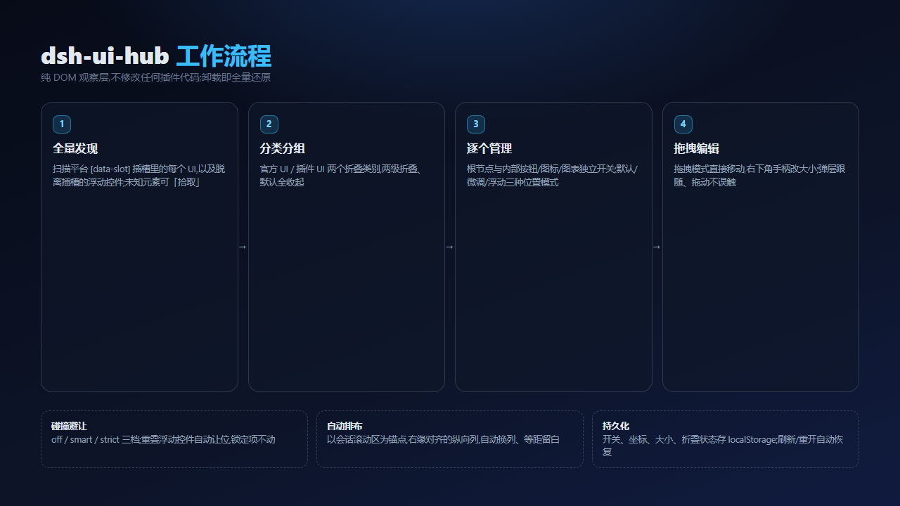

# UI 管家界面与功能展示 / UI Hub Gallery

> 所有截图来自 `test/mock.html` 复刻的 DSH 界面(不含任何真实账号数据)。
> 图片位置:`docs/assets/`

## 30 秒演示流程

1. 打开 DSH Web,右上角出现「UI 管家」入口胶囊;
2. 点击胶囊打开管理面板:默认只显示「官方 UI / 插件 UI」两个折叠类别;
3. 展开「官方 UI」:按插槽(会话标题栏操作、输入区下方、侧边栏底部……)分组,组默认仍折叠;
4. 再展开某个组:逐条显示该组 UI 的开关、官方标签与位置模式;
5. 打开「拖拽模式」:每个 UI 出现虚线框与右下角蓝色手柄,可直接拖动移动、拖手柄改大小;
6. 按 Esc 退出拖拽模式,一切恢复交互。

## 1. 默认面板:全部折叠,一目了然

- **入口胶囊**:右上角常驻,点击打开面板,快捷键 `Ctrl+Shift+U`(macOS `⌘⇧U`);
- **官方 UI / 插件 UI 两个类别**:默认全部折叠,只显示类别与数量,不会被几十个条目刷屏;
- **工具条**:自动排布、拾取元素、拖拽模式、恢复全部默认,四个按钮覆盖主要操作;
- **折叠状态会记住**:展开/收起后下次打开保持原样。

## 2. 展开「官方 UI」:按插槽分组

- 点击「官方 UI」后,该类别展开为多个**插槽组**:会话标题栏操作、输入区下方、模型选择等;
- 每个插槽组**默认仍折叠**,只显示组名与插槽名,需要时再逐组展开;
- 未展开的「插件 UI」保持收起,两个类别互不干扰;
- 组头右侧的开关可一键显示/隐藏整组 UI。

## 3. 展开某个官方组:逐条管理

- 每条 UI 显示:名称、归属(官方 UI / 插件名)、插槽名;
- **左侧开关**:单独显示或隐藏这个 UI;
- **官方标签**:蓝色「官方 UI」;第三方插件则显示金色「插件 UI」并附包名;
- **位置模式标签**:默认 / 微调 / 浮动,点 `⋯` 可填坐标或锁位置;
- `⋯` 详情里还能继续展开**内部元素**:按钮、图标、图表、输入框逐个开关。

## 4. 拖拽模式:直接移动与改大小

- 面板点「拖拽模式」后,所有已管理的 UI 出现**青色虚线框**;
- **直接按住任意 UI 拖动**,即改变位置(插槽内 UI 用平移保持布局,漂浮控件用固定坐标);
- 每个 UI 右下角出现**蓝色手柄,拖拽改变宽高**;
- 拖完不会误触按钮的点击,普通单击仍正常传给插件;
- 按 **Esc** 退出拖拽模式。

## 5. 防冲突与自动排布

- **碰撞避让**三档:关闭(只报告)/ 智能(明显重叠才让位)/ 严格(任何重叠都让位);
- 可对任意条目**锁定位置**,避让时只挤别人、不挤它;
- **一键自动排布**:以会话滚动区为锚点,把浮动 UI 沿右缘排成右对齐、等距留白的纵向列,超出一列自动换列;
- 所有开关、坐标、大小与折叠状态写入 `localStorage`,刷新/重开会话自动恢复。

## 6. 主宣传物料

- 主宣传图:`assets/promo-hero.png` / `assets/promo-hero.webp`
- 社交卡片:`assets/promo-social.png` / `assets/promo-social.webp`
- 鲸鱼娘首图提示词:`assets/whale-girl-prompt.md`
- 各渠道文案:[PROMO.md](PROMO.md)
